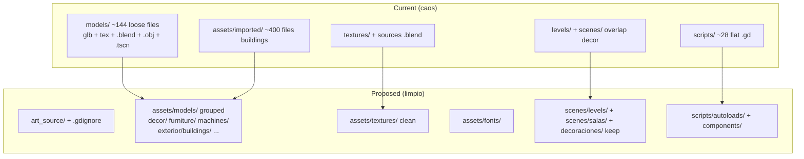
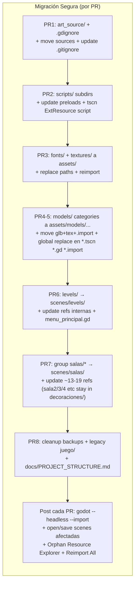
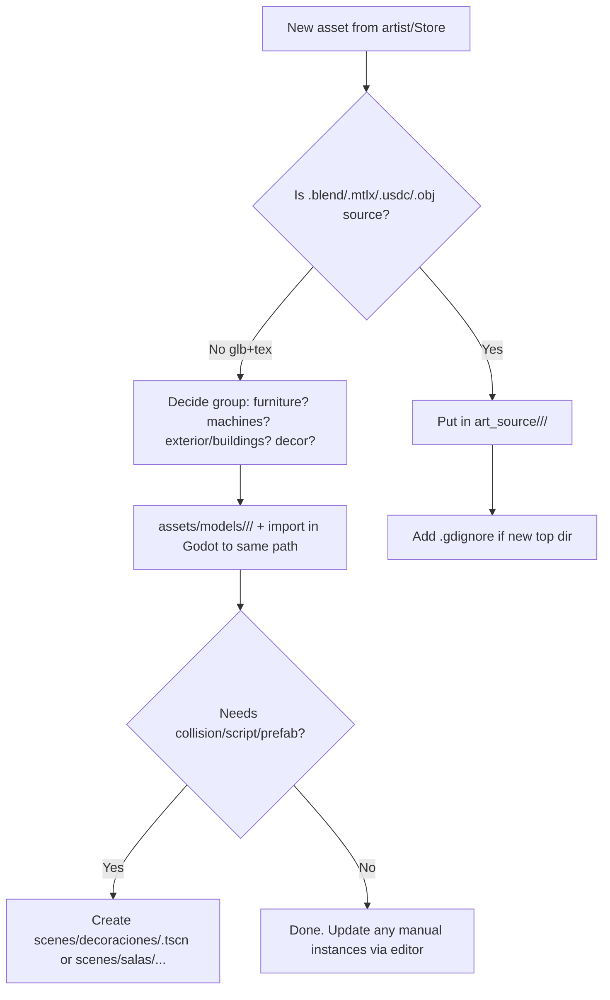

# Documento de Diseño: Reorganización Completa de Estructura de Carpetas y Assets del Proyecto Popopcorn (Godot 4)

**Autor:** [Placeholder - Ingeniero de Sistemas / Arquitecto]  
**Fecha:** 2026-06-03  
**Estado:** Draft  
**Versión:** 1.0  
**Proyecto:** popopcorn (Godot 4.6 Forward+, Jolt Physics, simulador 3D de gestión de cine: first-person, manejo de tienda/tienda, ciclo día-noche, visitantes/clientes, inventario, asientos, máquina de palomitas, etc.)

---

## Overview

El proyecto "popopcorn" es un juego 3D Godot 4 de simulación de gestión de cine en primera persona. El jugador camina por el teatro, interactúa con objetos, gestiona la tienda (tienda), el ciclo día/noche, sirve a "visitantes"/"clientes", maneja inventario, menús, asientos, máquina de palomitas, etc. La entrada principal es `res://scenes/menu/intro_cubyt.tscn`. Los autoloads en `project.godot` (7 entradas: Transicion como .tscn en scenes/ui/ + 6 .gd: SistemaNombreCine, GestorInicio, GestorMenus, GestorGameplay, GestorVisitantes, GestorInventario) apuntan a scripts planos en `scripts/*.gd`.

El estado actual presenta un "desorden total" (según feedback del usuario): ~1166 archivos de assets (310 en models/ +432 en imported/ + ~120+ en textures/ etc), ~11-17 top-level dirs + muchas sub (52 dirs a poca profundidad reportado inicialmente; actual ~ top-level items verificados via ls), con mezcla total de binarios de modelos (.glb/.obj), sus texturas, archivos fuente de arte (.blend, .mtlx, .usdc, .tres de Substance), .tscn sueltos y backups. Esto causa dolor en navegación del dock FileSystem de Godot, paths hardcoded en .tscn (ej. `ext_resource path="res://models/xxx.glb"`) y .gd (ej. `preload("res://models/popcorn.glb")`), duplicación (decoraciones en `models/decoraciones/exterior/` vs `scenes/decoraciones/exterior/` vs `assets/imported/` para buildings), scripts completamente planos (~28 .gd en scripts/ mezclando managers/sistemas/utils), backups committeados (*_backup.tscn), y ausencia de convenciones para nuevos imports (empeorará).

**Solución propuesta:** Reorganización completa y escalable siguiendo best practices de Godot 4 para proyectos 3D asset-heavy (agrupar assets cerca de scenes o por tipo bajo `assets/`, co-localizar scripts con scenes cuando sea posible, subdirs lógicos por dominio, merge de `levels/` bajo `scenes/`, aislamiento de source art). Estructura final con ~5-6 top-level dirs (art_source/, assets/, docs/, scenes/, scripts/, shaders/), assets limpios solo runtime, scripts organizados, convenciones documentadas en `docs/PROJECT_STRUCTURE.md`, y estrategia de migración incremental segura para Godot (uids, .import, refs en scenes/autoloads). Se divide en 8 PRs mergeables independientes.

Esto resuelve la mantenibilidad a largo plazo sin cambiar lógica de juego.

---

## Background & Motivation

**Estado actual (explorado vía list_dir/grep/read_file/run_terminal_command):**
- `project.godot`: main scene `res://scenes/menu/intro_cubyt.tscn`; autoloads 7 entradas (Transicion="*res://scenes/ui/transicion.tscn" + 6 .gd en scripts/: SistemaNombreCine, GestorInicio, GestorMenus, GestorGameplay, GestorVisitantes, GestorInventario; ver líneas 38-44); GestorGameplay.gd maneja tiempo/tienda/clientes, etc.; settings alta calidad (shadows 8192, MSAA, TAA, Jolt Physics).
- `levels/AreaBase/AreaBase.tscn` (raíz del mundo): instancia `res://scenes/exterior/exterior_cine.tscn`, `parking.tscn`, `scenes/decoraciones/*`, `scenes/personaje/personaje.tscn`, `scenes/jugabilidad/sistema_jugabilidad.tscn`, `scenes/ui/hud.tscn`, modules locales (blockout_areas.tscn, decoracion_lobby.tscn, paredes_conjunto.tscn, entorno.tscn, iluminacion_general.tscn, techo.tscn), usa sky shader + ciclo_dia_noche.gd.
- `models/`: caos primario. 310 archivos totales, 144 sueltos en root (incl. .import): ~43 *.glb/*.obj + texturas (alfombra.glb + alfombra_*.png, baso_soda.glb + 4 tex, bocina, cilla_negra, film + obj + múltiples Mat_*, glass, lampara*, modern_sofa, pantalla, planta, popcorn* + bucket + machine, PosteFila, silla_cine + BaseColor, smart_tv, waste_bin, wet_floor_sign, 3d_glasses* + variants + .obj + .tscn incluso, etc.) + metadata.json. Subs: `decoraciones/exterior/` (20+ glb+tex: arbusto, bardon_urinal, cardboard_box, old_*, wellworth toilet, etc.), `lampara_vip/`, `mesa_vip/` (glb + marble/onyx pngs + .blend + .mtlx + .usdc + .tres + .jpg), `sillabar/`.
- `assets/imported/`: ~432 archivos (building_pack.glb +50 tex, modular_motel, procedural_city_2/3, office_bin, poznan_district_clinic, building_buildify_nyc). Usados vía wrappers en `scenes/decoraciones/`.
- `scenes/`: ~121 .tscn total. Top-level: 17 items (16 dirs + suelo.tscn). `decoraciones/` (83 archivos totales: 71 .tscn wrappers + 6 .gd + 6 .uid; subs `popcorn/` con cubetas + 2 .gd (palomitas_piso.gd, relleno_palomitas.gd), `exterior/` con ~15 wrappers; otros 4 .gd en raíz de decoraciones/: colorear_palomitas.gd, cuadro_vip.gd, sala1_premium.gd, silla_bar.gd). Otras: `sala/` (6 .tscn + backups), `sala_cine/` (3), `jugabilidad/` (sistema + visitante), `menu/` (intro + principal + instances), `personaje/` (personaje.gd + .tscn co-localizado), `ui/`, `exterior/`, `iluminacion/`, `puertas/`, `bano/`, `cuarto_*`, `pasillo_salas/`, `cartel/`, `suelo.tscn`, `juego/` (con backups).
- `scripts/`: aproximadamente 28 .gd + 28 .uid (56 archivos) planos en raíz (sin subdirs; total .gd en proyecto: 41). Managers (gestor_gameplay.gd, gestor_menus.gd, gestor_visitantes.gd, gestor_inicio.gd, gestor_inventario.gd), sistemas (ciclo_dia_noche.gd, sistema_fila.gd, sistema_dormir.gd, sistema_nombre_cine.gd), entities (visitante.gd, cliente.gd, puerta.gd, puerta_doble.gd), utils (util_asiento.gd con class_name, multimesh_merger.gd), específicos (hud.gd, interruptor_tienda.gd, pantalla_interactiva.gd, mueble_sentarse.gd con class_name, etc.). Algunos co-localizados buenos en scenes/ (personaje.gd, menu/*.gd, ui/*.gd, decoraciones/*.gd como sala1_premium.gd, silla_bar.gd, colorear_palomitas.gd, palomitas_piso.gd, relleno_palomitas.gd, cuadro_vip.gd).
- `textures/`: Bien categorizado (alfombra/, carteles/ con movie posters, concreto_pared_vip/, piso_lobby/ + .blend/.mtlx/.tres/.usdc, piso_sala_*, plastico_*, techo*, tela_pared_sala/ con Poliigon .mtlx, etc.) pero polluted con sources.
- `shaders/`: sky/ (main.gdshader + util/triplanar.gdshaderinc), piso_no_tile, transicion, vidrio_* . Bien.
- `fonts/`: TitanOne simple.
- **Problemas específicos cuantificados (grep/find):**
  - 258 matches "res://models" (mayoría .import + .tscn wrappers + 2 .gd: palomitas_piso.gd:8 `preload("res://models/popcorn.glb")`, relleno_palomitas.gd; verificado con `grep -r --include="*.tscn" 'res://models'`).
  - 33 modelos glb/obj únicos de `models/` + 7 de `assets/imported/` = 40 referenciados directamente en .tscn (silla_cine, popcorn, popcornmachine, baso_soda, bocina, alfombra, cilla_negra, modern_sofa, pantalla, planta, lampara, film, glass, 3d_glasses, PosteFila, waste_bin, wet_floor_sign, smart_tv, + ~15 exterior + buildings; 0 .obj referenciados en tscn/gd; verificado `grep -r --include="*.tscn" 'path="res://.*\.\(glb\|obj\)"' | sed ... | sort | uniq`).
  - ~7 large en assets/imported/ (building_pack etc.).
  - ~107 "res://scenes/decoraciones/" (30+ files: AreaBase, blockout_areas, decoracion_lobby/vip, paredes_conjunto, sala.tscn, decoracion_exterior.tscn, pasillo, sala_cine_*, etc.).
  - 17 items top-level bajo scenes/ (16 dirs + 1 file suelo.tscn; verificado `ls scenes/ | wc -l`), 144 loose files solo en models/ root (maxdepth 1; verificado), 310 total en models/, 83 archivos en decoraciones/ (71 tscn +6 gd +6 uid).
  - Sources en textures/ (piso_exterior/Concrete032*.blend/.mtlx/.tres/.usdc, piso_lobby/Marble*, piso_sala_cine/Rubber*, tela_pared_sala/*.mtlx) + models/mesa_vip/ (4 .blend/.mtlx/.tres/.usdc).
  - Backups: solo `scenes/juego/juego_backup.tscn`, `scenes/sala/sala_backup.tscn`.
  - Refs scripts: preloads entre scripts/ (ej. gestor_visitantes.gd:3-5, sala_cine.gd:6, mueble_sentarse.gd:4, visitante.gd:31) + loads de scenes (menu_principal.gd:50 "res://levels/AreaBase/AreaBase.tscn").
  - .tscn wrappers simples (ej. `scenes/decoraciones/bardon_urinal.tscn`: solo Node3D + instance del glb de models/decoraciones/exterior/).
  - Texturas override directas desde models/ en algunos .tscn (lampara_exterior.tscn, mesa_vip.tscn, barra_bar.tscn, 3d_glasses_textured.tscn en models/).
  - Duplicación/split: decor en models/decoraciones/exterior/ vs scenes/decoraciones/exterior/ vs assets/imported/.
  - Sin docs/ (gitignore bloquea *.md*); sin convención para nuevos assets.

**Pain points:** Navegación Godot FS dock imposible con cientos de loose files. Al importar nuevo asset, Godot extrae tex al lado del .glb → caos garantizado. Hardcoded paths rompen fácil. Scripts planos: difícil mapear "qué pertenece a tienda vs visitantes vs ui". Inconsistencia co-locación scripts. Riesgo alto de rotura en cualquier refactor.

**Motivación:** Proyecto mediano (121 .tscn, 41 .gd) creciendo; necesita escalar sin dolor. Alineado con Godot best practices (agrupar assets, .gdignore para no-assets, snake_case; ver refs oficiales y comunidad: assets/ + scenes/ + scripts/ con sub-agrupación).

---

## Goals & Non-Goals

**Goals explícitos:**
- Estructura limpia, escalable y convencional para Godot 4 3D con heavy assets (unificar models/ + assets/imported/ + textures/ bajo assets/; agrupar por uso lógico para <50 loose files max por dir).
- Estrategia de source vs runtime: aislar .blend/.mtlx/.usdc/.obj sources (y archivos como 3d_glasses_textured.tscn/metadata.json) fuera del árbol res:// efectivo para Godot.
- Política clara de scripts: co-locate con .tscn cuando sea scene-specific (ej. props); centralizar managers/utils en scripts/ con subdirs (evitar flat ~28 .gd).
- Organización de scenes por feature/dominio (ui/, personaje/, decoraciones/ keep + levels/ mergeado bajo scenes/levels/, salas/ agrupado para bano/cuarto_*/pasillo/sala/sala_cine).
- Merge "levels/" bajo scenes/levels/ para un solo lugar de .tscn (nombre "levels/" elegido por convención std Godot + mínimo churn en refs; ver Key Decisions).
- Convenciones de naming: snake_case (Godot rec); mantener términos Spanish para dominios de juego (sala, decoraciones, personaje, visitante, tienda, palomitas) para alinear con código/variables (gestor_gameplay.gd, AreaBase.tscn, etc.); English para std engine (assets/, scenes/, scripts/, models/, ui/, levels/ para merged dir).
- Migración 100% safe para Godot: respetar uids (uid:// en ext_resource + .uid sidecars), .import (source_file, deps, dest_files, roughness/src_normal=), autoloads project.godot, refs en .tscn/.gd. Preferir ops que Godot editor entiende (drag en FS dock o replaces + reimport).
- Ejemplos concretos before/after (paths completos).
- Plan PR incremental (8 PRs pequeños, cada uno mergeable/reviewable, con deps).
- Docs: agregar docs/PROJECT_STRUCTURE.md (y ASSET_CONVENTIONS.md) + actualizar .gitignore (quitar *.md*, agregar art_source/ + .gdignore).
- Cuantificar: targets ~43 modelos → agrupados; reducir loose en models/ de 144 a ~0; ~258 refs models → actualizadas en batches.
- Incluir diagramas Mermaid (estructura current/proposed, flujo migración, workflow import nuevo asset).
- Riesgos explícitos + severidad + mitigación.
- Key Decisions + Open Questions.

**Non-Goals (scope boundaries):**
- No reescribir ni refactorizar lógica de juego (solo paths/estructura; ej. no tocar _ready de gestor_gameplay.gd o _generar_palomitas).
- No optimizaciones runtime (Multimesh, Jolt, shaders sky quedan).
- No anglicizar nombres de dominio (mantener "sala_cine", "decoraciones", "personaje", "visitante"; no forzar "room"/"props" si no ayuda).
- No eliminar assets "unused" sin decisión (ej. algunos buildings grandes en imported/; ver Open Questions).
- No tool de migración automática compleja (solo describe replaces + editor; no nuevo script godot bulk-mover).
- No cambios en export/pck o build.
- No agregar addons/ (ninguno actual).
- No documentar todo el gameplay (solo estructura + assets).

---

## Proposed Design

### Estructura de Alto Nivel Propuesta (Final)

```
popopcorn/
├── art_source/                  # NUEVO: todo source art NO-runtime. + .gdignore (oculta de Godot FS dock)
│   ├── models/
│   │   ├── mesa_vip/            # .blend .mtlx .usdc .tres de mesa_vip
│   │   └── ... (loose .obj, 3d_glasses_textured.tscn, metadata.json, etc.)
│   └── textures/
│       ├── piso_lobby/          # Marble*.blend etc.
│       └── ...
├── assets/                      # UNIFICADO + LIMPIO (solo runtime)
│   ├── fonts/                   # MOVED de root/ (TitanOne + .import)
│   ├── models/                  # UNIFICADO de models/ + assets/imported/ + models/decoraciones/exterior/
│   │   ├── decor/               # alfombra/, planta/, lampara* (incl. lampara_vip clean), cuadro?, wet_floor_sign, waste_bin, film?, glass?, 3d_glasses/
│   │   ├── electronics/         # bocina/, pantalla/, smart_tv_minimal_..., tv_vip related
│   │   ├── exterior/
│   │   │   ├── buildings/       # building_pack.glb + tex (50+), procedural_city_2/3, office_bin, poznan_*, modular_motel, building_buildify_nyc
│   │   │   └── small_props/     # arbusto.glb+tex, bardon_urinal, cardboard_box, desktop_computer, maceta_*, mesa, moldy_old_mattres, old_*, ventildador_*, wellworth_toilet (moved de models/decoraciones/exterior/)
│   │   ├── furniture/
│   │   │   ├── sillas/          # silla_cine/ (glb+BaseColor), cilla_negra/, modern_sofa/, old_soviet_chair/
│   │   │   ├── mesas/           # mesa_vip/ (glb + tex limpios, sources en art_source), mesa/
│   │   │   └── bar/             # sillabar/ (sillabar.glb)
│   │   ├── machines/
│   │   │   ├── popcorn/         # popcorn.glb + todas sus tex (0.jpg,1.png,...), popcorn_bucket.glb
│   │   │   └── popcornmachine/  # popcornmachine.glb
│   │   └── misc/                # baso_soda/ (glb+4 tex), PosteFila/, ...
│   ├── textures/                # MOVED de textures/ + CLEAN (solo png/jpg + .import; sources → art_source/)
│   │   ├── alfombra/
│   │   ├── carteles/            # movie*.jpg
│   │   ├── piso_lobby/          # Marble* (sin .blend)
│   │   ├── piso_sala_tiles/, piso_sala_cine/, zocalo_sala_tiles/
│   │   ├── plastico_silla_bar/, plastico_poste/, metal_poste/, cuerda/, mostrador/
│   │   ├── concreto_pared_vip/, paredes_vip/, techo/, techo_vip/
│   │   ├── tela_pared_sala/     # Poliigon sin .mtlx
│   │   ├── DecorPared/, lampara/
│   │   └── piso_exterior/, piso_exterior_styrofoam/
│   └── (sin shaders/ aquí; ver abajo)
├── docs/                        # NUEVO (permitir en git; .gdignore opcional si se quiere ocultar)
│   ├── PROJECT_STRUCTURE.md     # Descripción completa + convenciones + diagramas (este doc como base)
│   └── ASSET_CONVENTIONS.md     # Cómo importar nuevo asset (ver workflow abajo)
├── scenes/                      # TODOS los .tscn (merge levels aquí; agrupaciones)
│   ├── decoraciones/            # KEEP nombre (dominio Spanish); wrappers props + .gd específicos
│   │   ├── popcorn/             # cubetas + palomitas_piso.gd, relleno_palomitas.gd, colorear_palomitas.gd (co-localizados)
│   │   ├── exterior/            # wrappers ~15 (arbusto.tscn etc. que instancean de assets/models/exterior/small_props/)
│   │   ├── sala1_premium.gd + .tscn, silla_bar.gd + .tscn, sala*.tscn, maquina_palomitas.tscn, etc.
│   │   └── (building_*.tscn, office_bin*.tscn, modular_motel.tscn, procedural_*.tscn → refs actualizados a assets/models/exterior/buildings/)
│   ├── levels/                  # MERGE de old levels/ (para tener todos .tscn bajo scenes/; nombre "levels/" para std Godot + mínimo churn)
│   │   └── AreaBase/
│   │       ├── AreaBase.tscn    # paths internos actualizados: res://scenes/levels/AreaBase/modules/...
│   │       └── modules/         # blockout_areas.tscn, decoracion_lobby.tscn, paredes_conjunto.tscn, entorno.tscn, etc. (refs a decoraciones/ y textures/ quedan)
│   ├── salas/                   # NUEVO agrupamiento alto-nivel (evita 6+ dirs top en scenes/)
│   │   ├── bano/
│   │   ├── cuarto_empleados/
│   │   ├── cuarto_limpieza/
│   │   ├── pasillo_salas/
│   │   ├── sala/                # estructura_sala.tscn, fila_entrada.tscn, mostrador_sala.tscn, sala.tscn (sin backup), sala_modular.tscn
│   │   └── sala_cine/           # sala_cine.tscn, base_sin_escalones, equipada (refs bocina etc. actualizados)
│   ├── ui/                      # keep + co-localizar .gd (transicion.gd, hud.gd, navegador_pc.gd, dialogo_nombre_cine.gd)
│   ├── menu/                    # keep (intro_cubyt.gd + .tscn, menu_principal.gd + .tscn, instances)
│   ├── personaje/               # keep (personaje.gd + .tscn co-localizado; player controller)
│   ├── jugabilidad/             # keep (sistema_jugabilidad.tscn + scripts refs, visitante.tscn)
│   ├── exterior/                # keep (exterior_cine.tscn, parking.tscn; refs textures)
│   ├── iluminacion/             # keep (iluminacion_pasillo.tscn, sala.tscn; refs lampara)
│   ├── puertas/                 # keep (puerta_doble_cristal.tscn etc.; refs shaders)
│   ├── suelo.tscn               # o mover a scenes/common/suelo.tscn (simple)
│   └── (remover: juego/ completo + backups; cartel/ puede quedarse o mover a decoraciones/cartel/)
├── scripts/                     # NO más flat; subdirs + co-locación
│   ├── autoloads/               # Gestores y sistemas singleton (actualizar project.godot)
│   │   ├── gestor_gameplay.gd
│   │   ├── gestor_menus.gd
│   │   ├── gestor_visitantes.gd
│   │   ├── gestor_inicio.gd
│   │   ├── gestor_inventario.gd
│   │   ├── sistema_nombre_cine.gd
│   │   └── ...
│   ├── components/              # class_name + lógica reusable (actualizar todos preload("res://scripts/...
│   │   ├── util_asiento.gd    # class_name UtilAsiento
│   │   ├── mueble_sentarse.gd # class_name MuebleSentarse
│   │   ├── visitante.gd       # class_name Visitante
│   │   ├── punto_visitante.gd
│   │   ├── cliente.gd
│   │   ├── puerta.gd          # class_name Puerta
│   │   ├── puerta_doble.gd
│   │   ├── sala_cine.gd
│   │   ├── interruptor_tienda.gd # class_name
│   │   ├── letrero_tienda.gd
│   │   ├── letrero_nombre_cine.gd
│   │   ├── pantalla_interactiva.gd
│   │   ├── pared_limite.gd
│   │   ├── sistema_fila.gd
│   │   ├── sistema_dormir.gd
│   │   ├── multimesh_merger.gd
│   │   ├── optim_light_fixture.gd
│   │   ├── test_interaccion.gd
│   │   └── ...
│   ├── gameplay/                # lógica de tiempo/tienda (o merge en autoloads/components si pequeño)
│   │   ├── ciclo_dia_noche.gd
│   │   └── ...
│   ├── ui/                      # scripts ui no autoload
│   │   └── ...
│   └── (scripts específicos de props se mueven/co-localizan con su .tscn en scenes/decoraciones/ o scenes/salas/)
├── shaders/                     # KEEP en root (como código; similar a scripts). sky/ util/ intacto
│   ├── sky/main.gdshader + util/triplanar.gdshaderinc
│   └── piso_no_tile.gdshader, transicion.gdshader, vidrio_*.gdshader
├── project.godot                # Actualizado: autoloads paths nuevos, main_scene si aplica
├── icon.svg + .import
├── .editorconfig
├── .gitattributes
├── .gitignore                   # Actualizado (quitar *.md*, agregar art_source/, docs si hide, etc.)
└── (sin models/, textures/ top, levels/ top, fonts/ top)
```

**Diagramas Mermaid (estructura):**





**Workflow para nuevo asset (documentar en docs/ASSET_CONVENTIONS.md):**
1. Exportar .glb (texturas externas si posible) desde Blender/etc.
2. Colocar .glb + tex png/jpg en `assets/models/<grupo>/<nombre>/` (ej. `assets/models/furniture/sillas/nueva_silla/`).
3. En Godot editor: importar al path exacto (o drag al FS dock).
4. Si necesita prefab/collision/script: crear `scenes/decoraciones/<nombre>.tscn` (o en salas/ si room-specific) que instancie el glb + agregue componentes.
5. **Nunca** poner .blend/.mtlx dentro de assets/ o models/ → art_source/ + .gdignore.
6. Actualizar cualquier wrapper/referencia manualmente o vía editor.
7. Commit .glb + tex + .import (no sources).

**Ejemplos concretos before/after (críticos):**

1. **silla_cine (prop típico con collision wrapper):**
   - Before:
     - `models/silla_cine.glb`
     - `models/silla_cine_Cinema_Armchair_BaseColor.png`
     - `models/silla_cine.glb.import` (source_file="res://models/silla_cine.glb")
     - `scenes/decoraciones/silla_cine.tscn`:
       ```
       [ext_resource type="PackedScene" ... path="res://models/silla_cine.glb" id="1_modelo"]
       [node name="SillaCine" type="StaticBody3D"]
         [node name="Modelo" parent="." instance=ExtResource("1_modelo")]
         [node name="Colision" ...]
       ```
     - Usado en: `levels/AreaBase/modules/blockout_areas.tscn`, `scenes/sala/sala.tscn`, `scenes/decoraciones/decoracion_lobby.tscn` etc. (vía PackedScene).
   - After:
     - `assets/models/furniture/sillas/silla_cine/silla_cine.glb` + tex + .import (source_file actualizado a nuevo path vía replace).
     - `scenes/decoraciones/silla_cine.tscn` (path actualizado: `res://assets/models/furniture/sillas/silla_cine/silla_cine.glb`).
     - Refs en otros .tscn actualizados a nuevo path del wrapper (o uid ayuda).

2. **popcorn (con @tool script + preload directo):**
   - Before: `models/popcorn.glb` + ~10 tex variants (popcorn_0.jpg, popcorn_1.png, popcorn_Image_*, popcorn_nuevo_*); `scenes/decoraciones/popcorn/palomitas_piso.gd`:
     ```
     var popcorn_scene: PackedScene = preload("res://models/popcorn.glb")
     ... instantiate + random scale/pos (solo en editor_hint por costo)
     ```
     Similar en `relleno_palomitas.gd`; wrappers cubeta_*.tscn ref `popcorn_bucket.glb`.
   - After: `assets/models/machines/popcorn/popcorn.glb` + tex; preload → `res://assets/models/machines/popcorn/popcorn.glb`. Mismo para bucket.

3. **building_pack (large imported + wrapper):**
   - Before: `assets/imported/building_pack.glb` + 50 tex; `scenes/decoraciones/building_pack.tscn` (instance + scale 0.2).
   - After: `assets/models/exterior/buildings/building_pack/...`; wrapper path actualizado (mover wrapper a `scenes/decoraciones/` keep o sub).

4. **3d_glasses_textured.tscn + sources (unused artifact):**
   - Before: `models/3d_glasses_textured.tscn` (refs glb + albedo/metallic/roughness from models/); .obj variants + sources.
   - After: todo a `art_source/models/3d_glasses/` (no runtime).

**Snippets clave de código (interfaces afectadas):**

```gdscript
# scenes/decoraciones/popcorn/palomitas_piso.gd (cambia solo el string path)
var popcorn_scene: PackedScene = preload("res://assets/models/machines/popcorn/popcorn.glb")
```

```gdscript
# project.godot (autoloads; update paths)
[autoload]
GestorGameplay="*res://scripts/autoloads/gestor_gameplay.gd"
...
```

```gdscript
# levels/AreaBase/modules/blockout_areas.tscn (ej. ext_resource; uid estable)
[ext_resource type="PackedScene" uid="uid://..." path="res://scenes/decoraciones/silla_cine.tscn" id="silla"]
```

```gdscript
# scripts/gestor_visitantes.gd (ej. internal preload + load scene)
const VisitanteScript := preload("res://scripts/components/visitante.gd")
var escena := load("res://scenes/jugabilidad/visitante.tscn") as PackedScene
```

**Convenciones de naming (snake_case Godot + Spanish domains):**
- Folders/files: `sala_cine.tscn`, `gestor_gameplay.gd`, `popcorn_bucket.glb`.
- Node names: Pascal (SillaCine, CubetaLlena).
- Assets models: nombre original del asset + subgrupo lógico.
- Texturas shared: por material (Poliigon_..., Tiles074_...).

**Diagram Mermaid: Flujo de decisión para assets nuevos**



---

## API / Interface Changes

- **Paths de assets (antes/después ejemplos):**
  - `res://models/silla_cine.glb` → `res://assets/models/furniture/sillas/silla_cine/silla_cine.glb`
  - `res://assets/imported/building_pack.glb` → `res://assets/models/exterior/buildings/building_pack/building_pack.glb`
  - `res://models/decoraciones/exterior/bardon_urinal.glb` → `res://assets/models/exterior/small_props/bardon_urinal/bardon_urinal.glb`
  - Texturas override: `res://models/mesa_vip/...` → `res://assets/models/furniture/mesas/mesa_vip/...` (o mover a assets/textures/ si reusable).
- **Scenes wrappers:** `res://scenes/decoraciones/silla_cine.tscn` (keep nombre decoraciones/) o si agrupamos más, actualizar.
- **Scripts:** `res://scripts/gestor_gameplay.gd` → `res://scripts/autoloads/gestor_gameplay.gd`; `res://scripts/util_asiento.gd` → `res://scripts/components/util_asiento.gd`.
- **Levels (merged dir):** `res://levels/AreaBase/AreaBase.tscn` → `res://scenes/levels/AreaBase/AreaBase.tscn` (y todos los modules internos; final name "levels/" decidido).
- **Autoloads/main:** Actualizar strings en `project.godot`.
- **Preloads/loads en .gd:** ~20-30 cambios (ver grep results).
- **Uids:** Se mantienen (mover .uid sidecar con su recurso; ext_resource uid= permite que Godot resuelva incluso si path temporalmente stale).
- No cambios en signals (hora_actualizada etc. en gestor_gameplay), class_names (UtilAsiento, MuebleSentarse, Visitante, Puerta, HUD, etc.), o exports.

**Antes/después en un .tscn típico (extracto):**
```gd
# Antes
[ext_resource type="PackedScene" path="res://models/silla_cine.glb" id="1_modelo"]
...
# Después
[ext_resource type="PackedScene" uid="uid://..." path="res://assets/models/furniture/sillas/silla_cine/silla_cine.glb" id="1_modelo"]
```

---

## Data Model Changes

N/A (no bases de datos, no custom Resources .tres runtime persistentes más allá de los materiales implícitos en .import).

- Los .import se mueven con sus assets; sus campos internos (source_file, deps, roughness/src_normal= otras tex en el dir) se actualizan vía replace global de paths.
- .uid sidecars se mueven (contienen solo el uid hash, no paths).
- Migración: no DB migration; "reimport" Godot actúa como tal. Posible pérdida de import settings custom (compresión, etc.) si se borran .import (evitar; mover + replace en su lugar).
- Después de moves: Project > Reimport All o `godot --headless --import --path . --quit` para regenerar caches .godot/.

---

## Alternatives Considered

1. **Agrupación por feature/dominio completo (todo de "sala" en scenes/salas/sala/ + assets/models/salas/sala/ + scripts/salas/):** 
   - Pros: assets "cerca" de uso (Godot rec oficial), fácil ownership.
   - Cons: props como silla_cine/popcorn/bocina son shared (usados en lobby + salas + exterior); duplicación inevitable; subjetivo qué es "feature" vs "prop"; peor para assets grandes como buildings. Tradeoff: rechazada por shared nature del proyecto (cine con props reutilizables). (Similar a ejemplos comunidad que fallaron por subjetividad.)

2. **Mantener top-level models/ + textures/ + levels/ pero solo agregar subdirs + limpiar sources:** 
   - Pros: mínimo cambio de paths (solo internos), bajo riesgo.
   - Cons: no resuelve "unificación" (imported separado), sigue habiendo 2+ lugares para modelos, no agrupa alto-nivel (sigue ~15 dirs scenes/ top), no soluciona flat scripts. Tradeoff: rechazada; no es "reorganización completa".

3. **Poner todo bajo un "game/" o "data/" monolítico + assets embebidos en scenes:** 
   - Pros: reduce top dirs.
   - Cons: viola Godot FS model (assets importados desde dentro del proyecto); Godot recomienda assets separados para reusabilidad; empeora navegación para 400+ imported buildings. Tradeoff: rechazada.

Otras: Usar "addons/" para assets de terceros (oficial rec para third-party, pero estos son game assets); full anglicize (no, alinea con usuario Spanish + código existente).

---

## Security & Privacy Considerations

- Juego single-player offline (no networking, no user data persistente más allá de saves locales si los hay — no vistos en exploración).
- Amenazas: ninguna relevante (assets locales, no auth, no PII).
- Data handling: assets solo visuales/funcionales (posters de películas ficticios en carteles/).
- Migración: no expone nada; paths internos solo.

---

## Observability

- No cambios en logging/metrics (poco en el proyecto actual; usar print/debug en Godot o custom).
- Post-reorg: al importar, Godot logs warnings de paths rotos (monitorear Output dock).
- Alerting: N/A (dev only).
- Recomendación: agregar en docs/ sección para "después de PRs, verificar Output + FileSystem dock sin rojos".

---

## Rollout Plan

- **Feature flags:** N/A (reorg estructural; todo o nada por PR).
- **Staged rollout:** 8 PRs secuenciales (ver PR Plan abajo + "Migration Mechanics" subsection para one-liners y checklist detallado). Cada PR:
  - Branch desde main.
  - Cambios acotados (1 categoría assets o 1 agrupación scenes).
  - **Update paths**: para >20 files **preferir batch CLI replace (rg + perl/sed one-liner, ver Migration Mechanics) + git mv** sobre editor drag (drag en FS dock es best-effort solo para 1-5 files; para cientos como PR4/PR5 el editor puede colgar y no escala). Siempre git mv (nunca mv + git add).
  - Mover **siempre .uid sidecars** junto al recurso dueño (.tscn/.gd/.glb etc).
  - git mv para preservar history.
  - Commit + CI (si hay) + revisión.
  - Merge.
  - Post-merge en main: checkout, `godot --headless --import` (regenera .godot/ caches sin UI), **abrir editor GUI y re-guardar scenes afectadas** (esto normaliza `path=` en ext_resource de .tscn; headless **solo** actualiza caches de import, no reescribe paths en .tscn), Project > Tools > Orphan Resource Explorer (limpiar), Reimport All.
  - **Si stale errors persisten post-reimport**: close editor, `rm -rf .godot/`, re-run `godot --headless --import`, reopen.
- **Rollback:** `git revert <PR commit>` o branch restore. Como paths cambian, revert es seguro si se hace antes de más merges.
- **Validación por PR:** (ver checklist en "Migration Mechanics"): rg OLD_PATH ==0 (post replace, excl .godot/art_source); contar archivos; `godot --headless --import`; correr juego (intro → menu → AreaBase); chequear que palomitas generen en editor (@tool), tiempo/tienda funcione (gestor_gameplay), visitantes, interacciones; re-save GUI + Orphan + Reimport; si stale: nuke .godot/.
- **Riesgo de "big bang":** Evitado por incremental (ej. solo furniture en un PR; si falla, solo afecta sillas/mesas).
- **Godot headless:** `godot --headless --path . --import` (o con --quit después).

---

## Migration Mechanics (Accionable para todos los PRs)

**Nunca** hacer moves "a mano" sin replace previo para paths; Godot no reescribe .tscn/.gd/.import automáticamente en batch.

**Comandos concretos recomendados (CLI para batches >20 files; práctico vs editor drag):**
- Preview afectados (sin modificar):
  ```
  rg -l 'res://models/' --glob '!**/.godot/**' --glob '!art_source/**' | head -20
  rg -l 'res://levels/AreaBase/' --glob '!**/.godot/**' | cat
  ```
- Replace global seguro (usa perl para compatibilidad; rg para lista):
  ```
  rg -l 'res://models/' --glob '!**/.godot/**' --glob '!art_source/**' | xargs perl -pi -e 's|res://models/|res://assets/models/|g'
  rg -l 'res://scripts/' --glob '!**/.godot/**' --glob '!art_source/**' | xargs perl -pi -e 's|res://scripts/|res://scripts/components/|g'  # ajustar por subdir
  ```
  (Repetir por cada rename batch en PR; verificar post: `rg 'res://(models|levels|scripts)/' --glob '!**/.godot/**' --glob '!art_source/**' | wc -l` debe ser 0 para old prefixes.)
- Mover dirs/files (siempre git mv para history):
  ```
  git mv models assets/models  # o por subgrupo en PRs
  git mv levels scenes/levels
  git mv scripts/gestor_*.gd scripts/autoloads/   # + .uid
  # Para files sueltos: git mv foo.gd scripts/components/ ; git mv foo.gd.uid ...
  ```
- Siempre mover .uid sidecars con su dueño (.tscn, .gd, .glb, .shader etc.). Verificado: 47+ .uid en proyecto.
- Post replace+mv por PR:
  ```
  git status
  rg 'OLD_PATH_PREFIX' . --glob '!**/.godot/**' --glob '!art_source/**'   # debe dar 0
  godot --headless --path . --import --quit   # regenera caches
  # Si persisten errores stale: close editor, rm -rf .godot/ , re-run headless --import, reopen
  ```
- **Importante Godot-specific**:
  - `godot --headless --import` actualiza .godot/ y reimporta assets, pero **NO reescribe los `path=` en ext_resource de .tscn** (ni en algunos .gd). **Re-save en GUI editor es requerido** para normalizar ext_resource path= (incluso con uid= presente; uids permiten fallback pero paths se stalean).
  - Para batches grandes (PR4/PR5: 300+ files en models/imported): **editor drag en FS dock es impráctico** (puede colgar, muchas escenas abiertas, no escala a cientos). Usar CLI replace + git mv es el camino real; editor drag solo para 1-5 files (permite auto-update de escenas abiertas).
  - Después de PR, siempre: abrir editor GUI, re-guardar las .tscn afectadas (o "Save All"), correr Orphan Resource Explorer + Reimport All.
  - Para sources en PR1: después de mv .blend etc a art_source/, **delete los *.blend.import etc siblings** (prefer delete; no son assets runtime). Luego `godot --headless --import` no debe quejarse de sources ocultos por .gdignore.
  - Recuperación si caches rotos: `rm -rf .godot/ ; godot --headless --import` + reopen.

Estos one-liners + checklist se copiarán a `docs/PROJECT_STRUCTURE.md` + ASSET_CONVENTIONS.md en PR8. Mantener "no tool complejo permanente" (non-goal), pero instrucciones accionables evitan errores manuales en 258+ replaces.

---

## Open Questions

(Resolver antes de PR1; input del usuario requerido. Algunas resueltas por consistencia con árbol/PRs concretos.)

1. ~~Nombres exactos de subdirs en `assets/models/`~~: **Decidido** (ver Key Decision 6 y Proposed tree): usar English (decor/, electronics/, furniture/{sillas/,mesas/,bar/}, machines/{popcorn/,popcornmachine/}, exterior/{buildings/,small_props/}, misc/) como en los ejemplos before/after y PR4/PR5. Rationale: brevedad, nombres de assets externos comunes, community examples. Alternativas Spanish (muebles/ etc) se pueden adoptar después vía alias o rename extra si se prefiere full Spanish. ¿"small_props/" ok o cambiar a "props_exterior/"?
2. ¿Eliminar assets grandes no usados de `assets/models/exterior/buildings/` (procedural_city_2/3, poznan_district_clinic, building_buildify_nyc, algunos office_bin dups)? ¿O mantener por si acaso (y documentar)?
3. ¿Renombrar `scenes/decoraciones/` a `scenes/props/` (más claro, "no solo decor") o keep "decoraciones/" (menos refs rotos, alinea con código existente como "decoracion_exterior")?
4. ¿Borrar los 2 backups (`juego_backup.tscn`, `sala_backup.tscn`) en PR final, o mover a `art_source/backups/` / zip?
5. ~~Usar `scenes/levels/` vs `scenes/niveles/`~~: **Decidido** usar `scenes/levels/` consistentemente (ver Key Decision 4, tree, PR6). "levels/" para std Godot + mínimo churn (~11-19 refs afectados vs más si "niveles/"). ¿Agrupar también "jugabilidad/" bajo "systems/" o "gameplay/" en futuro?
6. ¿Agregar más docs (ej. CONTRIBUTING.md con "siempre usa editor para moves de assets")?
7. ¿Política estricta de no commitear .import? (No recomendado; Godot los necesita para reproducibilidad de imports.)

---

## References

- Godot 4 docs: Project organization (https://docs.godotengine.org/en/stable/tutorials/best_practices/project_organization.html) — assets cerca de scenes, .gdignore para folders no-import (usado para art_source/), snake_case.
- Godot 4.6 + Forward+ + Jolt Physics (project.godot).
- Estructura actual: `project.godot`, `levels/AreaBase/AreaBase.tscn`, `scenes/decoraciones/popcorn/palomitas_piso.gd`, `scripts/gestor_gameplay.gd`, `scripts/gestor_visitantes.gd`, wrappers en `scenes/decoraciones/*.tscn` y `scenes/decoraciones/exterior/`.
- Comunidad Reddit/YouTube ejemplos (assets/ + scenes/ + scripts/ con sub; levels bajo scenes).
- Archivos Godot: .import format (source_file, etc.), uid:// resolution, PackedScene instancing, @tool para editor previews (palomitas).

---

## Key Decisions

1. **Unificar todo assets runtime bajo `assets/models/` (agrupados lógicamente) + `assets/textures/` (limpios) y eliminar `models/` + `assets/imported/` + `textures/` top-level:** Rationale: elimina el "PRIMARY PROBLEM" (caos models/ + split imported), reduce top-level dirs, sigue Godot rec de assets/ folder (ver web/community + oficial). Fuentes van a art_source/. Cita: 258 refs models, 7+ buildings en imported, pollution .blend en textures/models.
2. **Usar `art_source/` + `.gdignore` (empty file) para sources (.blend etc.):** Rationale: oculta del Godot FileSystem dock (no se importan, no clutter), permite commit en git si se quiere (o .gitignore), previene future pollution al importar. Oficial Godot rec para non-asset folders (docs/ example). Cita: .gdignore en project_organization.html.
3. **Política de scripts: co-locate scene/prop-specific (ej. palomitas_piso.gd con su cubeta); centralizar managers/components en `scripts/autoloads/` + `scripts/components/` (con subdirs):** Rationale: resuelve "scripts completamente flat - hard to know which belongs to what". Mantiene class_name preloads fáciles. Co-locación ya parcial buena (personaje.gd, menu/*.gd). Cita: ~28 .gd en scripts/ (56 con .uid; total 41 .gd proyecto), 12 .gd en scenes/, preloads como en gestor_visitantes.gd:3-5 y sala_cine.gd:6.
4. **Merge `levels/` bajo `scenes/levels/` (en vez de top-level o keep separado; nombre final "levels/" para convención std + mínimo churn en ~11-19 refs):** Rationale: todos los .tscn en un lugar (escenas/); reduce top-level dirs de 8+ a 5-6. Módulos de AreaBase siguen siendo composition helpers. Cita: AreaBase.tscn refs modules + decoraciones; menu_principal.gd:50 load a levels/. (Decidido consistentemente vs "niveles/" para evitar ambigüedad.)
5. **Mantener `scenes/decoraciones/` (Spanish domain) + introducir `scenes/salas/` para agrupar rooms (bano, cuartos, pasillo, sala/, sala_cine/):** Rationale: provee "high-level grouping" (environment vs props vs ui vs rooms) sin romper demasiado (107 refs decoraciones pero keep nombre; ~13-19 refs para salas group). Nota: las escenas de salas completas como sala2.tscn, sala3.tscn, sala4.tscn, sala1_premium.tscn y Sala3_Premium.tscn (que son wrappers "decor" con bocinas/sillas) permanecen en scenes/decoraciones/ (no se mueven en PR7; ver Issue clarificación y PR7 desc). "decoraciones" ya usado en código (decoracion_exterior). Cita: blockout_areas.tscn:6-8 refs a decoraciones/salaN, decoracion_lobby.tscn, sala.tscn refs.
6. **Convenciones: snake_case + Spanish para game domains (sala, decoraciones, personaje, palomitas, visitante), English para std engine (assets/, scenes/, models/, ui/, scripts/, levels/):** Rationale: alinea con query usuario Spanish + nombres existentes (gestor_gameplay.gd, AreaBase, "sala_cine"); evita inconsistencias. Godot oficial rec snake_case. Subdirs bajo assets/models/ usan English (decor/, electronics/, furniture/{sillas/,mesas/,bar/}, machines/, exterior/{buildings/,small_props/}, misc/) como mostrado en árbol/PRs (elegido por brevedad + nombres de assets de terceros comunes en Godot; ver Open Q1 resuelto como "decidido: English como en ejemplos concretos"). 
7. **Migración vía global string replace (old res:// path → new) en *.tscn *.gd *.import + project.godot + git mv de assets (glb+tex+.import juntos) + post godot --headless --import + editor re-save:** Rationale: respeta uids (no cambian), actualiza paths en .import (source_file + roughness/src_normal), es batch-safe para 258+ refs, Godot entiende reimport. Prefer editor drag donde posible para batches pequeños. Cita: .import examples con source_file y roughness/src_normal apuntando otros models/.
8. **PRs incrementales (8, cada uno acotado por categoría o agrupación, mergeable, con deps explícitas):** Rationale: "strongly prefer operations Godot editor understands"; minimiza blast radius (ej. solo furniture no rompe todo); permite rollback fácil. Cada PR testable (correr intro → AreaBase).
9. **Agregar `docs/PROJECT_STRUCTURE.md` (basado en este doc) + actualizar .gitignore (quitar *.md*, agregar art_source/):** Rationale: previene future desorden ("When new assets imported, no convention"); hace accesible para el equipo. Cita: .gitignore actual bloquea *.md*.
10. **No borrar assets "grandes" sin decisión explícita; mover wrappers de scenes/decoraciones/ con sus refs:** Rationale: algunos buildings pueden ser intencionales para exteriores (usados en decoracion_exterior.tscn); wrappers son la "API" de colocación.

---

## Risks (explicit, severity, mitigation)

- **High: Rotura masiva de referencias de assets/scenes (258+ model paths, 107+ decoraciones, refs levels/salas internas, .import internos).** Severidad: High (juego no carga, editor lleno de errores rojos). Mitigación: incremental por PR/categoría (un grupo models por PR); global replace + git mv; post cada merge: headless import + re-save + grep old_path==0 + test play; uids ayudan a resolver; editor drag-drop actualiza caches.
- **Med-High: .import settings perdidos o .import desincronizados (source_file, deps, roughness/src_normal=).** Severidad: Med (texturas wrong, models no importan bien). Mitigación: **nunca borrar .import**; moverlos + replace strings dentro; reimport Godot regenera si necesario.
- **Med: Uids sidecars y embedded uid:// out of sync durante moves.** Severidad: Med (algunos refs stale hasta re-save). Mitigación: mover .uid con su owner; Godot resuelve por uid + path fallback; re-guardar scenes actualiza path= en ext_resource.
- **Med: Backups o legacy (juego_backup) causan confusión post-reorg.** Severidad: Low. Mitigación: PR final los maneja (borrar o art_source).
- **Med: Historial git "perdido" en moves masivos.** Severidad: Low. Mitigación: siempre `git mv` (o git add -A después de mv en batches).
- **Low: Nuevos imports futuros caen en caos si no se sigue convención.** Severidad: Low. Mitigación: docs/PROJECT_STRUCTURE.md + ASSET_CONVENTIONS.md + .gdignore; agregar a onboarding.
- **Low: .gdignore no funciona en algunos FS/Windows (trailing dot trick).** Severidad: Low. Mitigación: documentar "type nul > .gdignore" o editor; alternativa .gitignore + carpeta fuera de res://.

Riesgo overall: manejable por incremental + validación Godot nativa.

---

## PR Plan

El plan representa estrategia incremental realista. Cada PR es independientemente reviewable/mergeable (cambios acotados, tests manuales posibles, no big-bang; PR2 actualiza project.godot para que autoloads y scripts sigan funcionando inmediatamente post-merge). Orden: low-risk primero (setup, scripts), luego assets acoplados (models+wrappers), luego scenes grouping, cleanup final. Usar `git mv` + replace (CLI batch preferido para >20 files; ver "Migration Mechanics" abajo). Después de merge de cada uno: headless import + validación (incl. re-save GUI para normalizar path= en .tscn). Nota: siempre mover .uid sidecars junto con .tscn/.gd/.glb moved.

**PR 1: Title: "chore: introduce art_source/ with .gdignore and move source art files; update .gitignore and add docs/ skeleton"**  
Files/components affected: .gitignore (remove *.md*, add art_source/), root (new art_source/ + .gdignore), move all .blend/.mtlx/.usdc/.tres + unused (3d_glasses_textured.tscn, metadata.json, loose .obj no usados) de models/ y textures/ a art_source/models/... y art_source/textures/... + **delete associated *.blend.import / *.mtlx.import / *.usdc.import / *.obj.import siblings** (prefer delete: no son runtime reproducibility assets y evitarían warnings en reimport; ~16 sources + ~16 .import estimados); new docs/ (empty or stub PROJECT_STRUCTURE.md); no runtime changes.  
Dependencies: ninguna (base).  
Description: Primer paso seguro. Aísla sources (no más pollution). .gdignore oculta de Godot. Prepara para docs. Bajo riesgo (solo mueve no-runtime). **Migration note**: para sources + sus .import, delete los .import (a diferencia de runtime donde nunca se borran .import). Validar: Godot FS dock no muestra art_source/, fuentes no aparecen en import, `godot --headless --import` sin warnings de missing source para .blend etc. (ver Migration Mechanics).

**PR 2: Title: "refactor: reorganize scripts/ into autoloads/, components/, gameplay/, ui/ subdirs; update all internal preloads, tscn script ExtResource, AND project.godot autoload paths synchronously"**  
Files/components affected: scripts/ (crear subs, mover ~28 .gd + .uid); ~15-20 .gd con preload("res://scripts/...") (gestor_visitantes.gd, sala_cine.gd, mueble_sentarse.gd, visitante.gd, cliente.gd, etc.); ~10 .tscn con script= ExtResource de scripts/ (sistema_jugabilidad.tscn, mesa_con_sillas.tscn, banca.tscn, hud.tscn, AreaBase.tscn para ciclo, etc.); **project.godot** (actualizar las 6 líneas de autoload .gd de res://scripts/xxx.gd a res://scripts/autoloads/xxx.gd; Transicion .tscn queda en scenes/ui/); también cualquier otro ExtResource script= que apunte a scripts/ (verificado ~22 paths "res://scripts/" en .tscn total).  
Dependencies: PR1 (puede ser paralelo).  
Description: **Crítico para mergeabilidad independiente**: actualiza project.godot autoloads en este PR (no deferir). Limpia "flat ~28 .gd". Actualiza strings internos de scripts + project.godot + .tscn script attachments. Mantiene class_name. Riesgo med (preloads); **test inmediato post-merge**: correr intro → menu → AreaBase, verificar autoloads cargan (Gestor* + SistemaNombreCine), ciclo_dia_noche en Sol node, tienda/visitantes/tiempo funcionan, MuebleSentarse etc. sin errores. Validar: grep res://scripts/ (excluyendo nuevos paths) ==0; `godot --headless --import && echo "autoloads ok"`. (Esto evita estado broken intermedio.)

**PR 3: Title: "chore: move fonts/ and textures/ to assets/; clean remaining sources; update all texture/font paths in .tscn/.import/.gd"**  
Files/components affected: fonts/ → assets/fonts/; textures/ (move subs limpios) → assets/textures/; ~100s .tscn (refs tex piso_lobby, carteles, tela_pared etc. en AreaBase modules, sala.tscn, sala_cine.tscn, exterior_cine.tscn, decor tscns como lampara_exterior, mesa_vip, barra_bar); .import de tex; 4 refs en .gd (menu_principal.gd, intro_cubyt.gd); few .import con src_normal.  
Dependencies: PR1 (sources ya en art_source).  
Description: Consolida assets. Actualiza paths (incl. overrides de models/ que se limpiarán después). Riesgo med (muchos tex refs pero search-replace fácil). Validar: texturas aparecen correctas, no missing en editor.

**PR 4: Title: "refactor(assets): move large imported assets from assets/imported/ to assets/models/exterior/buildings/; update wrappers and references"**  
Files/components affected: assets/imported/* (move glb+tex+.import a assets/models/exterior/buildings/); scenes/decoraciones/ wrappers (building_pack.tscn, building_buildify_nyc.tscn, modular_motel.tscn, procedural_city_2/3.tscn, office_bin*.tscn x4, poznan...tscn); refs en decoracion_exterior.tscn (y sus usuarios: AreaBase, blockout?); ~272 matches pero mayoría .import moved.  
Dependencies: PR3 (assets/ base).  
Description: Unifica primer batch grande. Actualiza 7+ wrappers + sus refs (pocos). Incluye office_bin dups (pueden limpiarse aquí). Validar: exteriors renderizan (buildings en decoracion_exterior).

**PR 5: Title: "refactor(assets+scenes): move all remaining models/ (incl. decoraciones/exterior/) to assets/models/ grouped subdirs; update all model paths in wrappers/.tscn/.gd/.import"**  
Files/components affected: models/* completo (root loose + subs, glb+tex+.import) → assets/models/{decor/,electronics/,furniture/{sillas/,mesas/,bar/},machines/{popcorn/,popcornmachine/},misc/,exterior/small_props/}; scenes/decoraciones/ + exterior/ wrappers (~30 .tscn que ref models/); 2 .gd preloads (palomitas_piso.gd, relleno_palomitas.gd); ~258 model refs total (catch via replace); few texture overrides from models/ (mesa_vip etc.); scenes/decoraciones/exterior/ stay but their model refs update.  
Dependencies: PR4 (buildings ya movidos); PR2 (si scripts afectados).  
Description: El PR más grande pero acotado a assets + sus wrappers directos. Usa replace global para paths models/. Mueve grupos lógicos juntos. Incluye limpieza de 3d_glasses_textured etc. (ya en art_source si PR1). Validar: todos los props (silla_cine, popcorn, maquina, lamparas, plantas, bancas, etc.) cargan en lobby/salas/AreaBase; editor previews de @tool funcionan.

**PR 6: Title: "refactor(scenes): merge levels/ into scenes/levels/; update all internal and external references (modules, AreaBase, menu)"**  
Files/components affected: levels/ → scenes/levels/ (todo: AreaBase.tscn + modules/); actualizar refs internas en modules (blockout_areas.tscn etc. que usan res://levels/AreaBase/modules/...); actualizar AreaBase.tscn; ~5-10 refs externas (menu_principal.gd:50, AreaBase.tscn own sub-resources, decoracion_lobby? via grep); project.godot no (no load directo). **Final path: scenes/levels/ (consistente; ver tree y KeyDec 4)**.  
Dependencies: PR5 (si decor refs).  
Description: Consolida todos .tscn bajo scenes/. Paths cambian levels/ → scenes/levels/. Bajo volumen refs (~11-12 del grep inicial + internos en modules). Validar: main scene carga AreaBase completo (entorno, paredes, decor, personaje, hud, sistema jugabilidad).

**PR 7: Title: "refactor(scenes): group room-specific scenes under scenes/salas/ (bano, cuartos, pasillo_salas, sala, sala_cine); update cross references"**  
Files/components affected: mover bano/, cuarto_empleados/, cuarto_limpieza/, pasillo_salas/, sala/ (sin backups), sala_cine/ → scenes/salas/<sub>/; actualizar ~13-19 refs (AreaBase/modules/decoracion_lobby.tscn refs sala2/3/4 (que **permanecen** en decoraciones/), sala.tscn internal, sala_cine_*, pasillo_salas.tscn, juego/ legacy, decoracion_lobby etc.); refs en decoraciones/ o jugabilidad si las hay. **Scope note**: las "full room" como sala2.tscn, sala3.tscn, sala4.tscn, sala1_premium.tscn, Sala3_Premium.tscn (wrappers con bocina/sillas/texturas, ref'd desde blockout_areas.tscn:6-8 y decoracion_lobby) **se quedan en scenes/decoraciones/** (no se mueven aquí; son tratados como decor prefabs hoy; ver Proposed tree y KeyDec 5). El move de scenes/sala/ mueve solo los componentes estructurales (estructura_sala.tscn etc).  
Dependencies: PR6 (levels ya bajo scenes/).  
Description: Alto-nivel grouping para "salas/ambientes" (reduce dirs top). Volumen bajo (~13 para sala/ paths, ~19 broader rooms; verificado post-grep). Incluye actualizar sub-refs como estructura_sala dentro de sala/ (y refs desde decoracion_lobby a los salaN que quedan en decoraciones/). Validar: salas cargan (asientos, bocinas, posters, etc.) desde lobby y main; sala2/3/4 siguen funcionando vía sus paths en decoraciones/.

**PR 8: Title: "chore: final cleanup (remove backups/legacy juego/, add full docs/PROJECT_STRUCTURE.md + ASSET_CONVENTIONS.md, validate whole project)"**  
Files/components affected: remove scenes/juego/ (backups + legacy), any remaining backups; scenes/ root cleanup (suelo.tscn?); full docs/ (copiar contenido de este design + Mermaid + before/after + PR plan summary + convención import); .gitignore final; correr full validation (grep old paths ==0, godot --headless --import, play full flow, Orphan Explorer, reimport). (Nota: autoloads paths ya actualizados en PR2; no "if pending".)  
Dependencies: todos los anteriores (último).  
Description: Cierre. Asegura no quedan vestigios. Añade docs completos para futuro. Validación final del proyecto reorganizado. Después de merge: tag o release note con "estructura limpia".

Cada PR debe incluir en descripción: "Sigue design doc /tmp/grok-design-doc-ea60a7c9.md (o link en repo una vez committed)". Usar rg+perl/sed one-liners + git mv (ver Migration Mechanics) o search_replace en batches pequeños; editor drag solo para 1-5 files.

---

**Fin del documento.** Este diseño es concreto, cita paths y funciones reales del codebase explorado (ej. `levels/AreaBase/AreaBase.tscn:55`, `scenes/decoraciones/popcorn/palomitas_piso.gd:8`, `project.godot:32-44`), cuantifica, usa Mermaid, y provee plan accionable PR por PR. Implementar siguiendo el orden. Para dudas, resolver Open Questions primero.